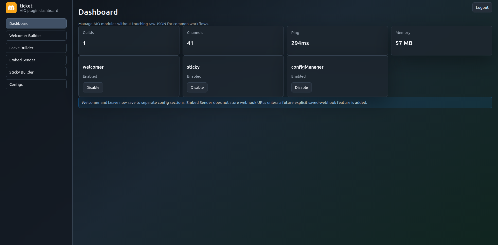
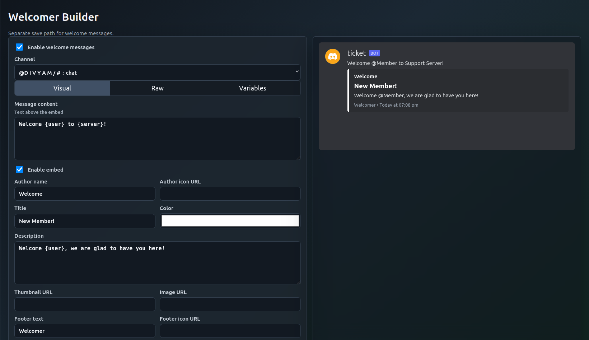
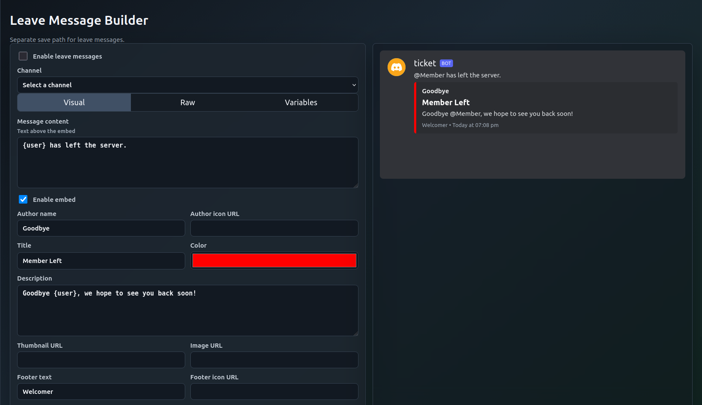
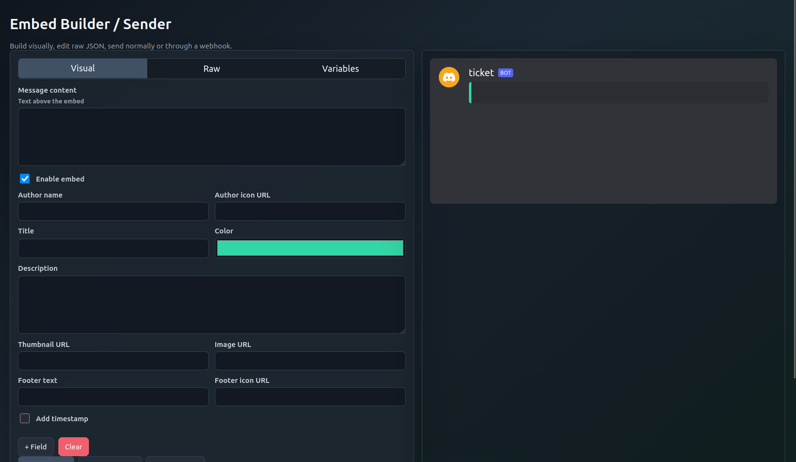
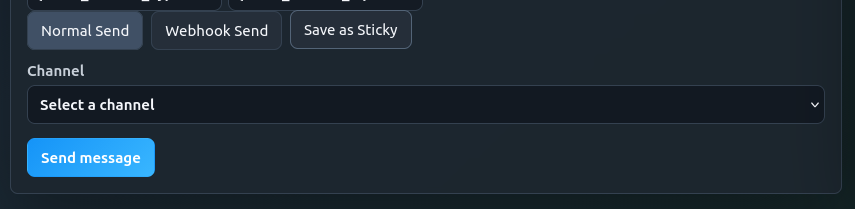
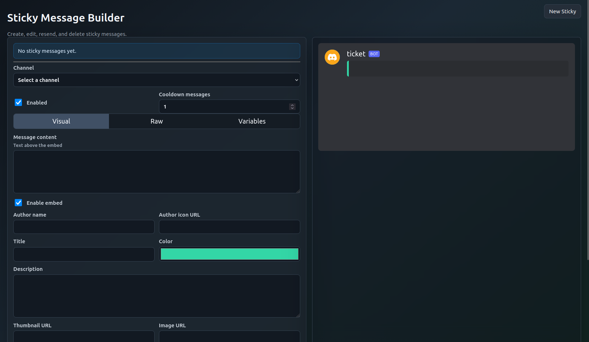
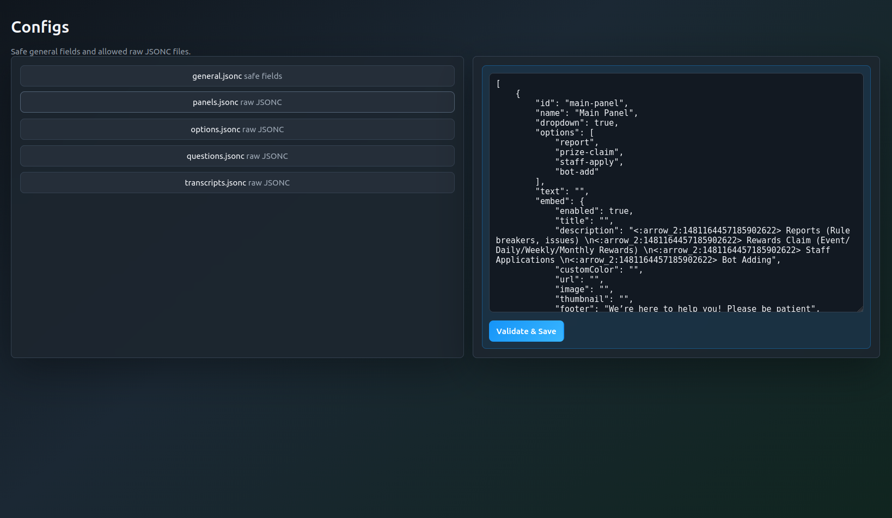
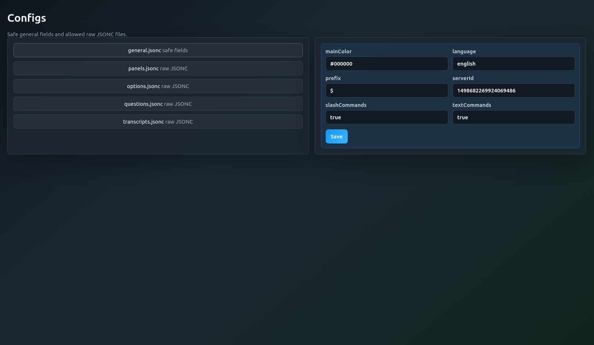

# Open Ticket AIO Plugin

All-in-one plugin for **Open Ticket v4.2.x**. Open Ticket AIO combines sticky messages, welcome and leave messages, a message/embed builder, webhook sending, and a protected dashboard config manager into one plugin.

> This is a community plugin by Divyam Goyal, with Eseclick listed as a contributor in `plugin.json`. It is built for Open Ticket, but it is not presented here as an official Open Ticket release.



## Overview

Open Ticket AIO provides a browser dashboard for common server setup workflows:

- Sticky Messages
- Welcomer
- Leave Messages
- Embed Builder
- Embed Sender
- Webhook Sender
- Dashboard Config Manager
- Variables System

The dashboard is served by the bot process and is protected by the password configured in `plugins/ot-aio/config.json`.

## Screenshots
















## Features

- Protected AIO web dashboard using Express sessions.
- Module toggles for sticky messages, welcomer, and config manager.
- Separate Welcomer Builder and Leave Message Builder save paths.
- Visual, Raw, and Variables tabs for builder workflows.
- Discord-style live preview using the bot's public identity.
- Bot avatar favicon when available from the Discord client.
- Embed author, title, description, fields, thumbnail, image, footer, timestamp, and color controls.
- Raw JSON editing with validation feedback in the dashboard.
- Normal bot message sending to selected Discord channels.
- Webhook sending with optional webhook username and avatar URL.
- Sticky message creation, editing, deletion, resend, enable toggle, and cooldown setting.
- Safe config editor for selected Open Ticket JSONC files.
- Backup creation before dashboard config writes.
- Slash commands for sticky and welcomer testing/reloading.

## Requirements

- Open Ticket `OTv4.2.1`.
- Node.js version compatible with Open Ticket 4.2.1 and the repo dependencies.
- Discord.js v14, already used by Open Ticket.
- A Discord bot token configured in Open Ticket.
- A bot invite with access to the channels you want to manage.
- Plugin dependencies listed in `plugin.json`:
  - `express`
  - `express-session`
  - `ejs`
  - `helmet`
  - `express-rate-limit`
  - `jsonc`

The root Open Ticket project already includes these dependencies in `package.json` in this workspace. If you move the plugin to another Open Ticket install, make sure those packages are installed.

## Installation

1. Copy the plugin folder into your Open Ticket plugins directory:

```txt
plugins/ot-aio
```

2. Confirm the plugin manifest exists:

```txt
plugins/ot-aio/plugin.json
```

3. Install missing dependencies from the Open Ticket root if your install does not already have them:

```bash
npm install
```

4. Build or start Open Ticket normally:

```bash
npm run build
npm run start
```

The plugin does not have its own separate package setup. It is compiled by Open Ticket through the normal plugin build process.

## Setup

Main configuration files:

- `plugins/ot-aio/plugin.json`
- `plugins/ot-aio/config.json`
- `plugins/ot-aio/welcomer.config.json`
- `plugins/ot-aio/sticky.config.json`
- `plugins/ot-aio/sticky.database.json`

Enable the plugin in `plugin.json`:

```json
{
    "enabled": true
}
```

Enable the dashboard in `config.json`:

```json
{
    "dashboard": {
        "enabled": true,
        "host": "",
        "port": 3000,
        "password": "change-this-password",
        "sessionSecret": "change-this-long-random-secret",
        "siteTitle": "Ticket Bot AIO Dashboard"
    }
}
```

Do not reuse public examples for `password` or `sessionSecret`. Restart the bot after changing plugin files or dashboard host/port settings.

## Dashboard Usage


When the bot is running and the dashboard is enabled, open:

```txt
http://128.0.0.1:3001
```

Use the configured dashboard password to log in. From the sidebar you can open:

- Dashboard
- Welcomer Builder
- Leave Builder
- Embed Sender
- Sticky Builder
- Configs

The dashboard exposes a safe bot identity endpoint that returns only public data such as username, ID, avatar URL, and mention. It does not expose the bot token.

## Welcomer Module


The Welcomer Builder edits only the `welcome` section of `welcomer.config.json`.

You can:

- Enable or disable welcome messages.
- Select the welcome channel.
- Edit message content.
- Build an embed visually.
- Use the Raw tab to edit the builder JSON.
- Use the Variables tab to copy placeholders.
- Preview the final Discord-style message live.
- Save the welcome config.
- Send a test preview to the selected channel.

Welcome messages are sent on `guildMemberAdd` when the welcomer module and welcome section are enabled.

## Leave Message Module


The Leave Message Builder edits only the `leave` section of `welcomer.config.json`.

You can:

- Enable or disable leave messages.
- Select the leave channel.
- Edit message content.
- Build an embed visually.
- Use the Raw tab to edit the builder JSON.
- Use the Variables tab to copy placeholders.
- Preview the final Discord-style message live.
- Save the leave config.
- Send a test preview to the selected channel.

Leave messages are sent on `guildMemberRemove` when the welcomer module and leave section are enabled.

## Embed Builder


The Embed Builder is a standalone message builder and sender. It does not overwrite Welcomer or Leave settings unless you explicitly use the Save as Sticky action.

Supported builder controls:

- Message content.
- Embed enable toggle.
- Author name.
- Author icon URL.
- Author URL in raw payload.
- Title.
- Description.
- Embed color picker.
- Thumbnail URL.
- Image URL.
- Footer text.
- Footer icon URL.
- Timestamp toggle.
- Add, remove, and edit fields.
- Field inline toggle.
- Visual editor.
- Raw JSON editor.
- Variables tab.
- Live Discord-style preview.
- Validation before sending or saving.
- Clear button.

Raw JSON mode accepts the builder payload used by the dashboard. Invalid JSON is shown as an error instead of crashing the dashboard.

## Embed Sender


Normal Send uses the bot identity.

To send a message:

1. Open Embed Sender.
2. Build the message or embed.
3. Choose Normal Send.
4. Select a text or announcement channel.
5. Click Send message.

The backend validates the channel and sends through the Discord client.

## Webhook Sender


Webhook Send uses a Discord webhook URL supplied at send time.

Supported options:

- Webhook URL.
- Optional webhook username.
- Optional webhook avatar URL.
- Message content and embeds from the builder.

Security behavior:

- Webhook URLs are validated before sending.
- Webhook URLs are not logged by the dashboard code.
- Webhook URLs are not stored by the plugin.
- After a successful send, the dashboard masks the webhook token in the input field.

Webhook URLs are secrets. Never share them, publish them, paste them in screenshots, or commit them to a repository.

## Sticky Messages


Sticky messages are managed by the Sticky Builder and saved in `sticky.database.json`.

You can:

- View configured sticky messages.
- Create a new sticky message.
- Select the target channel.
- Enable or disable the sticky.
- Set cooldown messages.
- Build the message/embed with the same dashboard builder.
- Save a sticky.
- Resend a sticky.
- Delete a sticky.

The sticky module can also be configured through slash commands. Required slash-command permission is controlled by `sticky.config.json`:

```json
{
    "commandPermission": "admin"
}
```

Valid values are `admin`, `developer`, and `owner`.

## Variables

The dashboard includes a copyable Variables tab. Some variables are available for dashboard previews, while runtime replacement depends on the module using the message.

### Runtime Replacements

These replacements are implemented in the runtime send logic.

| Context | Variables |
| --- | --- |
| Welcomer and Leave | `{user}`, `{user_name}`, `{display_name}`, `{server}`, `{member_count}` |
| Sticky Messages | `{server_name}`, `{member_count}`, `{user_count}`, `{date}`, `{time}`, `{guild_id}`, `{channel_id}` |

### Dashboard Variable Picker

These variables are present in the dashboard variable picker for builder workflows.

| Group | Variables |
| --- | --- |
| Bot | `{bot_name}`, `{bot_id}`, `{bot_avatar}`, `{bot_mention}` |
| User | `{user}`, `{user_name}`, `{user_display_name}`, `{user_id}`, `{user_mention}`, `{user_avatar}`, `{user_created_at}`, `{user_joined_at}` |
| Server | `{server_name}`, `{server}`, `{server_id}`, `{server_icon}`, `{member_count}`, `{boost_count}`, `{boost_tier}`, `{owner_id}`, `{owner_mention}` |
| Time | `{now}`, `{now_timestamp}`, `{date}`, `{time}`, `{unix}`, `{relative_time}` |
| Welcome | `{member}`, `{member_name}`, `{member_display_name}`, `{member_id}`, `{member_mention}`, `{member_avatar}`, `{member_count}`, `{server_name}` |
| Leave | `{member}`, `{member_name}`, `{member_id}`, `{member_avatar}`, `{member_count}`, `{server_name}` |
| Ticket | `{ticket_id}`, `{ticket_name}`, `{ticket_channel}`, `{ticket_channel_id}`, `{ticket_creator}`, `{ticket_creator_id}`, `{ticket_creator_mention}`, `{ticket_category}`, `{ticket_claimed_by}`, `{ticket_created_at}` |

Backward-compatible preview handling exists for `{nowtimestamp}`, but new configs should prefer `{now_timestamp}`.

## Config Files

### `plugin.json`

Defines the plugin name, ID, supported Open Ticket version, dependencies, and incompatible plugins.

This plugin declares incompatibility with:

- `ot-sticky-messages`
- `ot-glassy-dashboard`
- `ese-welcomer`
- `ot-dashboard`

### `config.json`

Controls the AIO dashboard and module toggles:

- Dashboard host, port, password, session secret, and title.
- Sticky module toggle.
- Welcomer module toggle.
- Config manager toggle.
- Backup directory.
- Raw JSONC files allowed in the dashboard config editor.

### `welcomer.config.json`

Stores separate `welcome` and `leave` sections. The dashboard saves those sections independently.

### `sticky.config.json`

Stores sticky module settings, slash-command permission, boot resend behavior, and optional legacy sticky-only dashboard settings.

### `sticky.database.json`

Stores configured sticky messages.

### Dashboard Config Manager


The Configs page can edit:

- Safe fields from `config/general.jsonc`.
- Raw JSONC for files allowed by `configManager.allowRawJsoncFiles`.

The current implementation supports raw JSONC access for:

- `panels`
- `options`
- `questions`
- `transcripts`

Before writing changes, the dashboard creates backups in the configured backup directory.

## Permissions

The bot needs the usual Open Ticket permissions plus permissions for the features you use:

- View Channels.
- Send Messages.
- Embed Links.
- Read Message History.
- Manage Messages for deleting previous sticky messages.
- Attach Files if you use stored file attachments through sticky slash commands.
- Manage Roles if you enable welcome role assignment.
- Direct Messages from members if you enable welcome DM messages.

Webhook sending through an existing webhook URL does not require the bot to create a webhook. If you expect the bot to create or manage webhooks elsewhere, grant Manage Webhooks for that separate workflow.

## Troubleshooting

### Dashboard not loading

- Confirm `dashboard.enabled` is `true`.
- Confirm the configured host and port are reachable.
- Check whether another process is already using the port.
- Restart the bot after changing dashboard host or port.

### Plugin not loading

- Confirm the folder is `plugins/ot-aio`.
- Confirm `plugin.json` has `"enabled": true`.
- Confirm the Open Ticket version is `OTv4.2.x`.
- Check for incompatible plugins listed in `plugin.json`.
- Run `npm run build` from the Open Ticket root and read any TypeScript errors.

### Embed not sending

- Confirm a valid text or announcement channel is selected.
- Confirm the bot can view and send messages in the channel.
- Confirm the bot has Embed Links permission.
- Add message content or at least one embed value before sending.

### Webhook sending failed

- Confirm the webhook URL is valid and still active.
- Do not use masked webhook URLs for sending.
- Confirm Discord has not deleted or revoked the webhook.
- Do not paste webhook URLs into logs, commits, or public support messages.

### Channel not showing

- Confirm the bot is in the guild.
- Confirm the channel is a text or announcement channel.
- Confirm the bot can see the channel.
- Restart the bot if guild/channel cache was stale.

### Config not saving

- Confirm the Config Manager module is enabled.
- For raw config files, confirm the file key is listed in `allowRawJsoncFiles`.
- Validate JSONC syntax before saving.
- Check the backup directory if you need to restore a previous version.

### Open Ticket version mismatch

This plugin declares support for `OTv4.2.1`. Other Open Ticket versions may require code changes.

## Security Notes

- Never commit `.env`.
- Never commit a bot token.
- Never expose dashboard passwords or session secrets.
- Never expose webhook URLs.
- Never publish private config values.
- Keep dashboard access protected with a strong password.
- Prefer binding the dashboard to `127.0.0.1` unless you intentionally place it behind a secure reverse proxy.
- Rotate webhook URLs immediately if they are exposed.

## Credits

- Built for Open Ticket.
- Plugin author: Divyam Goyal.
- Contributor listed in plugin metadata: Eseclick.
- Open Ticket is by the Open Ticket project and its maintainers.
